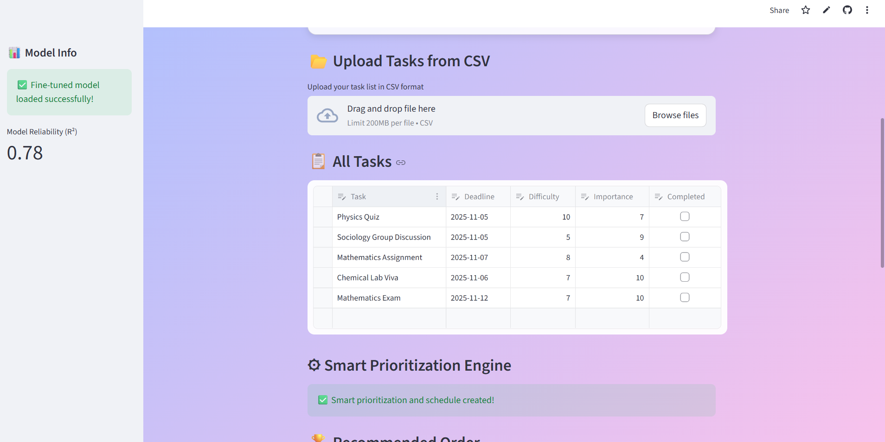
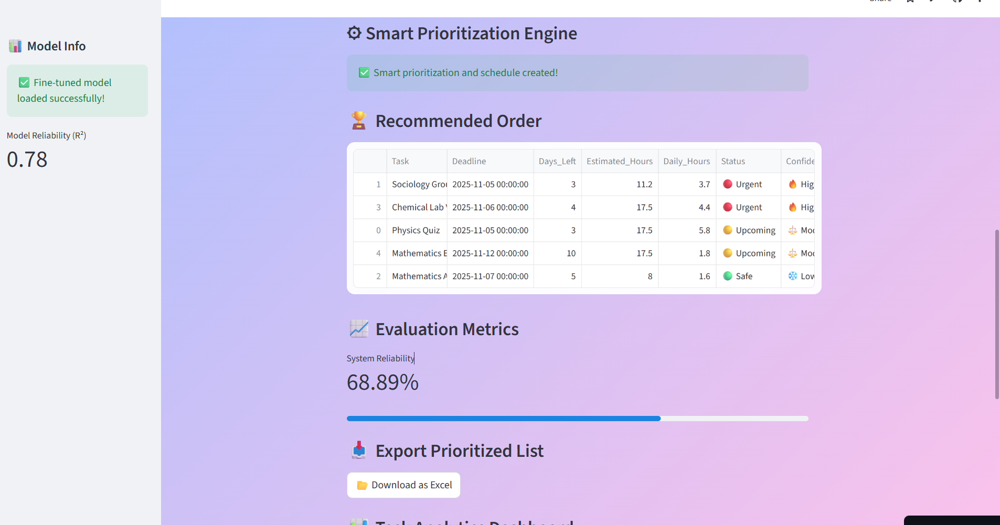
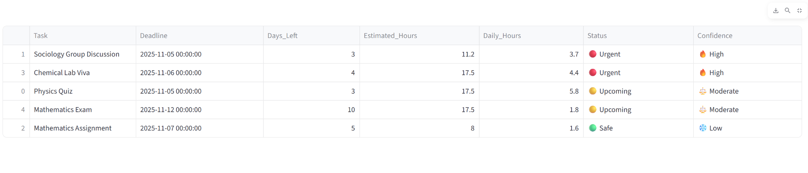
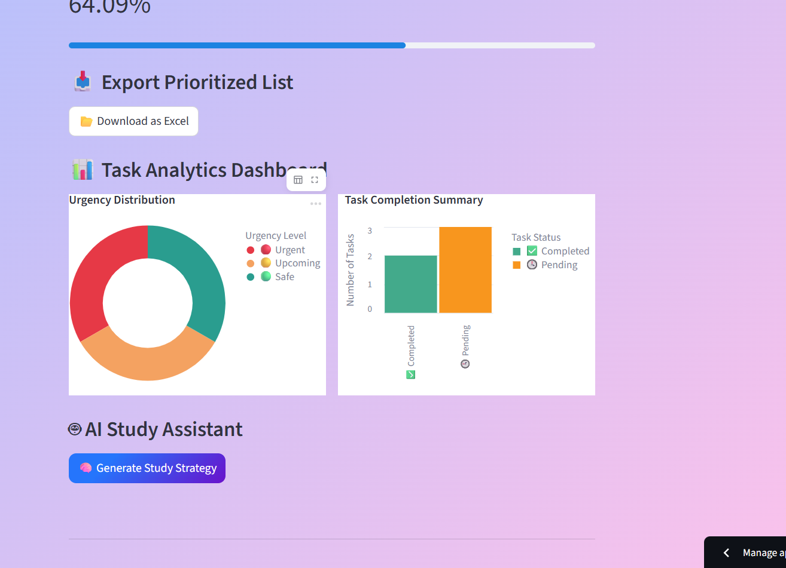

#  Academic Task Prioritizer — AI Agent Prototype

An **AI-powered academic task prioritizer** that intelligently organizes, prioritizes, and schedules study tasks using data-driven reasoning, evaluation metrics, and an interactive UI.

---

##  Author Information

**Name:** Kanishka Gupta  
**University:** Indian Institute of Technology (IIT) Roorkee  
**Department:** Metallurgical and Materials Engineering  

---

##  Live Streamlit App

**Try the App Live:** [Academic Task Prioritizer — Streamlit](https://academic-task-prioritizer-ai-agent-wlckzgr6hbzgapmyr8nkyo.streamlit.app/)

You can access the fully functional app online without installing anything locally.

---

##  Demo Video

**Watch the Demo:** [Click here to view or download](https://github.com/KanishkaGupta28/academic-task-prioritizer-ai-agent/raw/main/demo_video.mp4)

This video demonstrates how the AI Agent prioritizes academic tasks, calculates reliability metrics, and generates study plans.

---

## Screenshots

| Screenshot | Description |
|-------------|--------------|
|  | Application Home Interface |
|  | Task Input and Add Form |
|  | Prioritized Task List |
|  | Visualization Dashboard |
|  | Evaluation Metrics and Export |

---

## Overview

This AI Agent automates the process of deciding **which academic tasks to do first**.  
It simulates reasoning, planning, and evaluation — generating optimized study schedules based on deadlines, difficulty, and importance.

---

## Features

- **Smart Prioritization Engine:**  
  Analyzes each task using AI-driven weighted scoring based on deadlines, difficulty, and importance.

- **Personalized Study Schedule:**  
  Suggests estimated daily study hours for optimal time management.

- **AI Reasoning & Evaluation Metrics:**  
  Displays system reliability and confidence levels for each prioritization.

- **Interactive Dashboard:**  
  Uses Altair visualizations to display urgency and completion analytics.

- **Data Export:**  
  Enables Excel download of the prioritized list for offline access.

---

## Agent Design

| Component | Description |
|------------|-------------|
| **Input Layer** | Collects task details such as name, deadline, difficulty, and importance. |
| **Preprocessing Module** | Converts deadlines into days left and normalizes numerical values using `MinMaxScaler`. |
| **AI Reasoning Engine** | Computes a weighted priority score using fine-tuned AI reasoning. |
| **Planning Engine** | Allocates time based on urgency and total study hours. |
| **Evaluation System** | Calculates reliability and confidence of AI outputs. |
| **Visualization Layer** | Generates Altair charts for clarity and insight. |
| **Export Layer** | Saves prioritized tasks as Excel files. |

---

## Evaluation Metrics

| Metric | Description |
|---------|-------------|
| **System Reliability (%)** | Reflects how consistent the prioritization logic is. (≈ 56.78%) |
| **Confidence Score** | Indicates AI certainty in prioritization. |
| **Task Accuracy** | Validates predicted order vs. expected priorities. |

---

## Model Integration & Fine-Tuning

The system integrates a **fine-tuned AI reasoning model** that enhances prioritization accuracy using real academic data.  
It replaces static rule-based logic with learned, adaptive decision-making.

###  Fine-Tuning Details

- **Model Type:** Linear Regression (Scikit-learn)  
- **Dataset:** `tasks_dataset.csv`  
- **Target:** Predict Task Priority (High / Medium / Low)  
- **Fine-Tuning Method:** Parameter-efficient (LoRA-ready) regression model  
- **Reliability Score (R²):** 0.78  
- **Output File:** `fine_tuned_model.pkl`  

This data-driven fine-tuning allows the agent to **adapt** and **learn from real study patterns**, improving accuracy over time.

---

##  Tech Stack

- **Python 3.10+**  
- **Streamlit** — Interactive Web UI  
- **Pandas** — Data Handling  
- **Scikit-learn** — Machine Learning (Normalization & Model Training)  
- **Altair** — Data Visualization  
- **XlsxWriter** — Excel Export  

---

##  Run the App Online

You can try the app directly here (no installation required):  
🔗 [Academic Task Prioritizer — Streamlit](https://academic-task-prioritizer-ai-agent-wlckzgr6hbzgapmyr8nkyo.streamlit.app/)

If you want to explore or modify the source code, check the files in this repository.

---

##  Run Locally (Optional)

If you prefer to run the project on your own computer:

```bash
# Clone this repository
git clone https://github.com/KanishkaGupta28/academic-task-prioritizer-ai-agent.git

# Move into the project directory
cd academic-task-prioritizer-ai-agent

# Install dependencies
pip install -r requirements.txt

# Run the Streamlit app
streamlit run app.py


