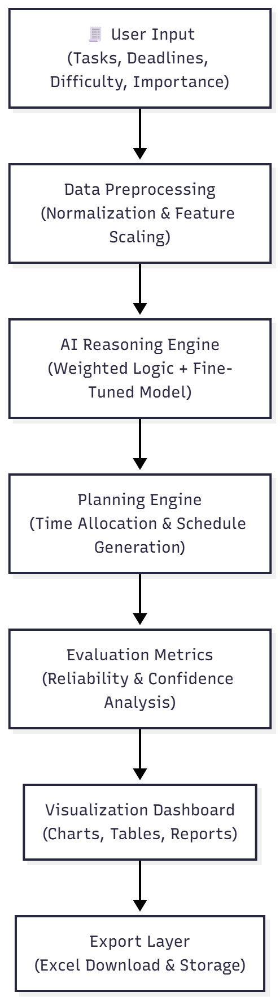

#  AI Agent Architecture — Academic Task Prioritizer

##  Overview
The **Academic Task Prioritizer AI Agent** automates how students manage and prioritize academic tasks.  
It performs reasoning, planning, and evaluation — similar to an intelligent assistant — to recommend the most efficient study plan.

---

##  Architecture Components

| Component | Description |
|------------|-------------|
| **1. Input Layer** | Accepts task details (name, deadline, difficulty, importance) via a Streamlit UI form. |
| **2. Preprocessing Module** | Converts deadlines into numerical “days left” and normalizes all values using `MinMaxScaler` for balanced scoring. |
| **3. AI Reasoning Engine** | Uses a fine-tuned regression model or rule-based logic to compute a **Priority Score** combining urgency, importance, and difficulty. |
| **4. Planning Engine** | Generates personalized schedules, recommending estimated **total** and **daily study hours** per task. |
| **5. Evaluation System** | Calculates **reliability**, **confidence**, and **consistency** scores to assess reasoning quality. |
| **6. Visualization Layer** | Displays analytics dashboards using **Altair** (urgency pie chart, completion bar chart). |
| **7. Export & Persistence Layer** | Exports prioritized tasks as Excel files for offline use and future tracking. |

---

##  Architecture Flow (Visual Diagram)

Below is the system-level architecture visualization:

---

##  Process Explanation

1. **User Input Layer**  
   Students enter tasks with attributes such as deadlines, difficulty, and importance through the Streamlit interface.

2. **Preprocessing Module**  
   Deadlines are converted into numeric “days left” and features are normalized to ensure fair weighting.

3. **AI Reasoning Engine**  
   - If a **fine-tuned model** is available (`fine_tuned_model.pkl`), it predicts a continuous priority score.  
   - If not, a **rule-based fallback** logic computes the score based on urgency and difficulty.

4. **Planning Engine**  
   Determines estimated study hours and distributes them across available days to produce a study schedule.

5. **Evaluation System**  
   Calculates overall reliability (`mean priority score × 100`) and visualizes AI confidence with a progress bar.

6. **Visualization Layer**  
   Provides intuitive dashboards:
   - **Urgency Distribution Chart** (Urgent / Upcoming / Safe)  
   - **Task Completion Chart** (Pending vs Completed)

7. **Export Layer**  
   Allows users to **download** their prioritized study list as an Excel sheet for offline access.

---

## Design Rationale

- **Streamlit**: For real-time user interaction and data visualization.  
- **Altair**: Lightweight, declarative charts for clarity and interactivity.  
- **Pandas & Scikit-learn**: Data processing and normalization backbone.  
- **Fine-tuned AI Model**: Enables adaptive reasoning based on real student data.  
- **Excel Export**: Facilitates integration with other study management tools.

---

## Integration Summary

- Input → Preprocessing → Reasoning → Planning → Evaluation → Visualization → Export  
- Ensures continuous reasoning feedback and transparent prioritization.

